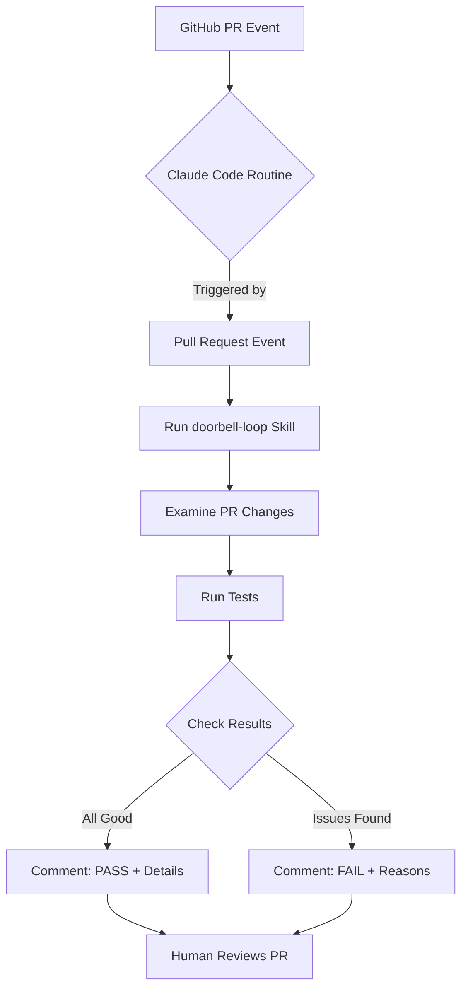

# Project 6: The Doorbell Loop

This directory contains the implementation for Project 6 from the Loop Engineering crash course: **"The doorbell loop - A loop that reacts to a pull request, with no prompt typed."**

## Project Overview

As specified in the crash course:
> **Build.** Make your throwaway repo review its own pull requests. On the OpenCode approach, run `opencode github install` and accept the workflow it generates. On the Claude Code approach, create a Routine with a GitHub pull-request trigger (the [appendix](#appendix-routines) walks through the filters). Then open a PR that contains one planted bug, such as an off-by-one or a deleted null check, and wait.
> 
> **Done when** the PR gets a review you never asked for, and the review flags the planted bug. If the review misses it, tighten the prompt and push again. The push fires the loop once more through the synchronize event, and that re-fire is the event heartbeat working.

## Files Included

### Core Implementation
- `.claude/skills/doorbell-loop/SKILL.md` - The skill that reviews pull requests for bugs
- `.claude/agents/pr-reviewer.md` - The reviewer agent definition (used by the skill)

### Sample Code for Testing
- `../05-clarify-the-body/src/calculator.py` - Buggy implementation (in sibling project)
- `../05-clarify-the-body/test/test_calculator.py` - Tests that will fail on bugs

## How to Use This Project

### 1. Understanding the Components
The doorbell loop consists of:
- **Skill** (`doorbell-loop/SKILL.md`): Defines what to check in PRs
- **Agent** (`pr-reviewer.md`): The actual reviewer that does the checking
- **Routine**: Would be configured in Claude Code to trigger on PR events

### 2. Conceptual Workflow
In a real implementation with GitHub and Claude Code:



### 3. What the Skill Checks
The doorbell-loop skill is designed to detect common bugs like:
- Off-by-one errors in loops or arithmetic
- Improper error handling (e.g., returning strings instead of raising exceptions)
- Incorrect mathematical operations
- Logic flaws in conditional statements

### 4. Setting Up the Real Routine (Conceptual)
To implement this as a real Claude Code Routine:

1. **Go to**: `claude.ai/code/routines`
2. **Click**: "New routine" → "Remote"
3. **Configure**:
   - **Prompt**: `/doorbell-loop` (or paste the skill content directly)
   - **Repositories**: [your-throwaway-repo-with-buggy-code]
   - **Connectors**: GitHub (essential for PR events)
   - **Trigger**: GitHub event → pull request (opened, synchronized, reopened)
   - **Environment**: Add GITHUB_TOKEN for commenting on PRs

### 5. Testing the Concept
To see how the reviewer would work without setting up GitHub webhooks:

```bash
# Conceptually, this is what would happen when a PR is opened
# The reviewer would examine the PR and respond with PASS or FAIL
```

## Related Concepts from Crash Course

- **Concept 7: Event-driven** - The GitHub pull request trigger starts the loop
- **Concept 10: Connectors** - GitHub connector enables the loop to act on PRs  
- **Concept 11: Maker-checker** - Separate reviewer agent checks PR changes
- **Concept 12: Spine** - Would use progress.md to remember state between PR reviews

## Notes
- This project is designed to work alongside project 05-clarify-the-body which contains the buggy calculator code
- The skill and agent files are ready to be used in a Claude Code Routine
- For actual deployment, you would need a GitHub repository and Claude Code account

---
*Implementation note: The actual GitHub webhook integration requires a Claude Code Pro/Max/Team plan and proper repository setup. This directory contains the core logic needed for Project 6.*